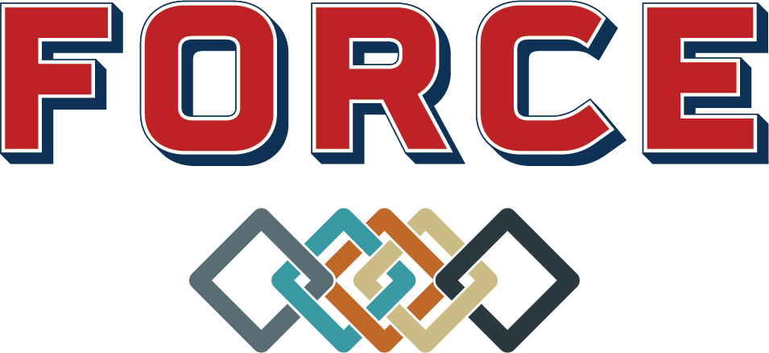

The Framework for Optimization of ResourCes and Economics is a collection of software tools, models, and datasets acquired and developed under the Integrated Energy Systems (IES) program to enable analysis of technical and economic viability of myriad IES configurations. FORCE is the consolidating interface and data repository for all the IES toolsets ranging from macro technoeconomic analysis to transient process modeling and experimental validation for integrated energy systems.

# Tools
The FORCE framework makes use of several distinct tools to enable technical and economic system analysis of integrated energy systems. The three main tools are:

- [HYBRID](https://github.com/idaholab/HYBRID), which includes technical models of energy systems,

- [ORCA](https://github.com/idaholab/ORCA), which provides tools for the real-time optimization of integrated system control, and

- [HERON](https://github.com/idaholab/HERON), for long-term system cost, portfolio sizing, and dispatch optimization.

While FORCE is a framework that connects these tools, currently each tool can be used independently for different parts of the integrated energy systems technical and economic analysis.

## FORCE Use Cases

In addition to the tools available as part of FORCE, several existing use cases that demonstrate use of FORCE are included by way of example in this code base. These are listed in brief below:

| SHORT NAME                                | DESCRIPTION                                                                                                                 | REPORT                                      |
|:-----------------------------------------:|:---------------------------------------------------------------------------------------------------------------------------:|:-------------------------------------------:|
| [2020_12](use_cases/2020_12/)             | Evaluation of Hybrid FPOG Applications in Regulated and Deregulated Markets Using HERON                                     | [OSTI](https://www.osti.gov/biblio/1755894) |
| [2021_12](use_cases/2021_12/)             | A Technical and Economic Assessment of LWR Flexible Operation for Generation and Demand Balancing to Optimize Plant Revenue | [OSTI](https://www.osti.gov/biblio/1844211) |
| [BrandonShores](use_cases/BrandonShores/) |                                                                                                                             |                                             |
| [LWRS](use_cases/LWRS/)                   | Production of Fischer-Tropsch Synfuels at Nuclear Plants                                                                    | [OSTI](https://www.osti.gov/biblio/1892316) |

## Testing
The FORCE repo should contain several IES tools. For the FORCE tests in "FORCE/tests/integrations_tests" to work, raven, TEAL, and HERON should be under FORCE. The FORCE tests depend on raven libraries which can be activated as follows: `conda activate raven_libraries`

## Citing FORCE
FORCE is included in the U.S. Department of Energy [CODE database](https://www.osti.gov/doecode/biblio/74301), which includes citation guidelines for several citation styles.
DOI:10.11578/dc.20220511.2
